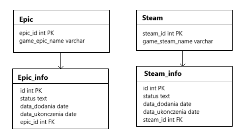

# SQL Solution for conditional selection of table to update
Let us assume that we have two tables with the name of the game and unique id: epic and steam. Each of them is connected to another table: epic with epic_info and steam with steam_info. Both tables contain the following information: unique id, status, added date, finish date and another id which is a foreign key.

In this case, firstly we want to verify if the game is on epic or steam. Secondly, add game end date and change status from 'W toku' (In progress) to 'Ukończona' (Completed).
